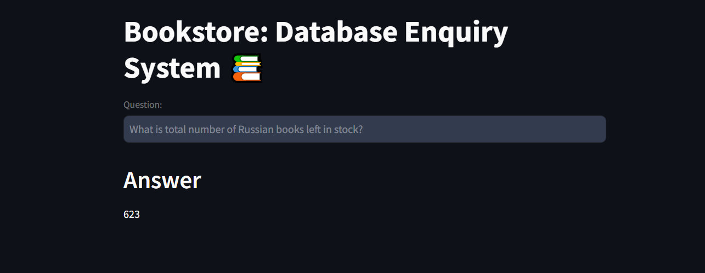

# Books Retail Enquiry System

This is a chatbot application that interacts with a MySQL database based on which it can reply to the queries asked by the user. It makes use of MySQL Workbench 8.0 and MySQL Server 8.0 installed on the device. The database used is connected to the MySQL server using the localhost on root.

## Problem Statement

A bookstore has books of various publishers, languages and genre with a database management system that maintains the details of their price, discount and stock. However, the database can only be interacted with through a MySQL query. This makes it difficult for the employees of the store to keep track of the items.

To increase the accessibility of the database, this application will take queries in natural language and return the required result.

## Tools and Frameworks

- UI: Streamlit
- LLM: Google PaLM
- Embeddings: HuggingFace
- Vectorstore: Chromadb

Additionally, few shot learning has been implemented for enhancement in query results.

## Installation

## Execution

## Project Structure

- books_data.sql: Contains the MySQL query to produce the database. It produces two table, namely, books and discounts, populated with random numbers and order of items.

- few_shots.py: Has the prompts used for few shot learning

- requirements.txt: Contains a list of packages needed for the usage of this application

- sql_prompt.py: Connects to the database and contains the mysql_prompt for Langchain

- main.py: Streamlit application script for the UI